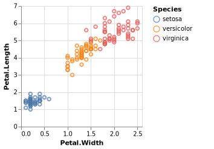
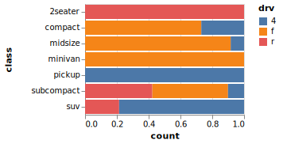

<!-- README.md is generated from README.Rmd. Please edit that file -->

# ggvega

<!-- badges: start -->

[](https://cran.r-project.org/package=ggvega)
[](https://www.tidyverse.org/lifecycle/#experimental)
[](https://travis-ci.org/vegawidget/ggvega)
<!-- badges: end -->

The goal of **ggvega** is to translate a ggplot2 object to a Vega-Lite
specification.

``` r
library(ggvega)
#> Welcome to ggvega; this package is not yet fully functional, and is under active development.
library(ggplot2)

g <- 
  ggplot(iris) + 
  geom_point(aes(x = Petal.Width, y = Petal.Length, colour = Species))

as_vegaspec(g)
```

<!-- -->

``` r
g <- 
  ggplot(data = mpg, aes(x = class, weight = displ)) +
  geom_bar(aes(fill = drv), position = "fill") +
  coord_flip()

as_vegaspec(g)
```

<!-- -->

### Important Note

This package is in an experimental state, under active development.

At present, we can translate:

  - `geom_point()`, `geom_bar()`
  - `stat_count()`
  - `position_stack()`, `position_fill()`
  - `coord_flip()`
  - unit-plots; no facetting.

## Installation

You can install the development version from
[GitHub](https://github.com/) with:

``` r
# install.packages("devtools")
devtools::install_github("vegawidget/ggvega")
```

Internally, this package uses
[V8](https://cran.r-project.org/package=V8) to run JavaScript code. This
package uses a “modern” version of JavaScript (ES6); it requires that V8
use a modern JS engine. You can check this using:

``` r
V8::engine_info()
```

Here’s a good response:

    $version
    [1] "7.2.502.24"

This response means you need to upgrade your V8 engine:

    $version
    [1] "3.14.5.9"

The upgrade-procedure varies according to your OS:

  - Windows and Mac OS-X: should [just
    work](https://github.com/jeroen/V8#installation).

  - Ubuntu: [update using](https://github.com/jeroen/V8#debian--ubuntu)
    `sudo apt-get install -y libv8-dev`
    
      - **note**: as of Dec. 2019, the [RStudio
        Cloud](https://rstudio.cloud) image uses the `3.14` (old)
        engine. We, as users, do not have access to `sudo`.
        Unfortunately, for now, you cannot run this package on RStudio
        Cloud.
