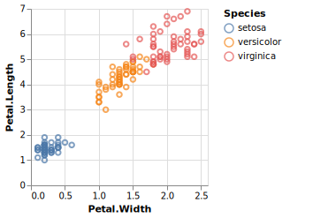

<!-- README.md is generated from README.Rmd. Please edit that file -->

# ggvega

<!-- badges: start -->

[](https://cran.r-project.org/package=ggvega)
[](https://www.tidyverse.org/lifecycle/#experimental)
[](https://travis-ci.org/vegawidget/ggvega)
<!-- badges: end -->

The goal of **ggvega** is to translate a ggplot2 object to a Vega-Lite
specification.

``` r
library(ggvega)
#> Welcome to ggvega; this package is not yet fully functional, and is under active development.
library(ggplot2)

g <- 
  ggplot(iris) + 
  geom_point(aes(x = Petal.Width, y = Petal.Length, colour = Species))

as_vegaspec(g)
```

<!-- -->

``` r
g <- 
  ggplot(data = mpg, aes(x = class, weight = displ)) +
  geom_bar(aes(fill = drv), position = "fill") +
  coord_flip()

as_vegaspec(g)
```

<!-- -->

### Important Note

This package is in an experimental state, under *very* active
development.

At present, we can translate:

  - `geom_point()`, `geom_bar()`
  - `stat_count()`
  - `position_stack()`, `position_fill()`
  - `coord_flip()`
  - unit-plots; no facetting.

## Installation

You can install the development version from
[GitHub](https://github.com/) with:

``` r
# install.packages("devtools")
devtools::install_github("vegawidget/ggvega")
```
