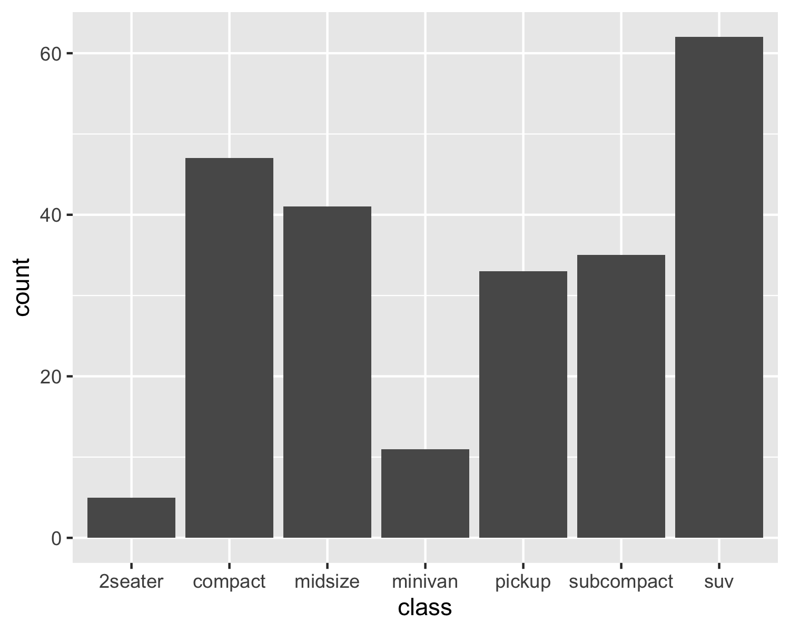
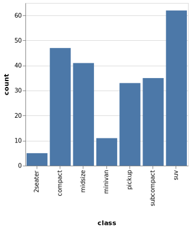

```{r setup, include=FALSE}
knitr::opts_chunk$set(warning = FALSE, message = FALSE)
options(htmltools.dir.version = FALSE)
library(tidyverse)
library(htmltools)
library(ggvega)
library(vegawidget)
```

```{r setupmore, include=FALSE}
cars <- jsonlite::fromJSON("https://vega.github.io/vega-lite/data/cars.json")

set.seed(314)
n_obs <- 100

toy_prob <- tribble(
  ~value, ~probability,
  "a",         0.35,
  "b",         0.25,
  "c",         0.10,
  "d",         0.10,
  "e",         0.1
)

data_all <- 
  tibble(
    user_id = seq(1, 2 * n_obs),
    value = 
      sample(
        toy_prob$value, 
        size = 2 * n_obs, 
        replace = TRUE, 
        prob = toy_prob$probability
      )
  )  

data_init <- data_all[data_all$user_id <= n_obs, ]
data_new <- data_all[data_all$user_id > n_obs, ]
```

### ggvega: from ggplot2 to Vega-Lite  

.pull-left[
.center[

]]
.pull-right[



]

.pull-left[

```{r include=FALSE, fig.width=4, fig.height=3}
p <- ggplot(cars, aes(x = Horsepower, y = Miles_per_Gallon)) +
  geom_point(aes(color = Origin)) 

p
# ggvega::dev_gallery()
```
]
.pull-right[
```{r include=FALSE, fig.asp=.65}
p <- ggplot(cars, aes(x = Horsepower, y = Miles_per_Gallon)) +
  geom_point(aes(color = Origin)) 

as_vegaspec(p)
```
]


.footnote[
This project has been supported by Iowa State University, Schneider Electric, and GSOC.
]

---
class: inverse, center, middle
# Motivation


---
### Build & deploy visual components 

.left-third[

```{r echo=FALSE}
g <- ggplot(data_init, aes(x = value)) + geom_bar()

vs <- as_vegaspec(g)

vegawidget(vs, elementId = "demo-aggregate")
```

```{r control, echo=FALSE}
control <- 
  tags$div(
    tags$span("dataset"),
    tags$select(
      name = "demo-aggregate-dataset",
      tags$option(value = "data_init", "Initial"),
      tags$option(value = "data_new", "New")
    )
  )

control
```

```{r dataset, echo=FALSE}
dataset <-
  tags$pre(
    tags$code(
      name = "demo-aggregate-data",
      class = "json hljs remark-code",
      "{}"
    )
  )

dataset
```

```{r data, echo=FALSE}
ser <- function(x) {
  x <- purrr::transpose(x)
  x <- jsonlite::toJSON(x, auto_unbox = TRUE)
  
  x
}

data_script <- 
  tags$script(
    type = "text/javascript",
    glue_js(
      "var data_all = {'data_init': ${ser(data_init)}, 'data_new': ${ser(data_new)}};"
    )
  )

data_script
```

]
.right-two-thirds[

We want to connect the data-scientists who design visualizations and the customers who use these visualizations

We want the ability to take into account new data after visualization has been designed

This goal, being **extensible to new data**, has been a guiding principle when making fundamental design choices.

This factor distinguishes this effort from `plotly::ggplotly()`


]

???

> Compared to `plot_ly()`, statistical queries (client-side) with `ggplotly()` are fundamentally limited. That’s because, the statistical R functions that ggplot2 relies on to generate the graphical layers can’t necessarily be recomputed with different input data in your web browser.


---
### ggplot2 + Interactivity

.left-third[
.center[
<br/>
<br/>
<br/>
**(graphic here?)**
]
]
.right-two-thirds[

What we want in a JavaScript library:

  - open source  
  
  - "easy" to use
  
  - has the grammar of graphics at its foundation  
  
  - can be tied to ggplot2  
]

---
background-image: url(https://repository-images.githubusercontent.com/177215911/6cf7df00-c0dd-11e9-9559-c70f5ce9c8f0)
background-size: 1200px
background-position: 50% 85%
### Vega + Vega-Lite


Designed to be a visualization grammar that is built for analysis

An implementation of visualization terms with the **grammar of graphics** at its core

Both Vega and Vega-lite use a JSON specification to create a visualization

<br/>

???

.center[
.salt[data  ].fat[  stat  ].acid[  mapping  ].heat[  geom]
]

.center[
.salt[data  ].fat[  transform  ].acid[  encoding  ].heat[  mark  ]  
]

.center[
.salt[salt  ].fat[  fat  ].acid[  acid  ].heat[  heat]
]


---
### Motivating use-case for ggvega

A data-scientist designs a visualization using R with ggplot2  

The ggplot2 object is translated to a Vega-Lite specification (using ggvega)  

The Vega-Lite specification can be deployed to production, independently of the data used to design it. 

Vega provides the means to update Vega views with new data.

<br/><br/>
.center[
**add graphic**
]

---
class: inverse, center, middle
# Design Philosophy

---
### Fundamental design choices

**Design choice #1:**  Intention vs. Implementation?

**Initial philosophy:** narrow scope built on a firm foundation.


**Approach: ** a two-step process

1. ggplot2 -> ggspec: convert a ggplot2 object into a "ggspec", a JSON-serializable list  

2. ggspec -> vegaspec: convert a "ggspec" into a Vega-Lite specification or "vegaspec".

<br/>

.center[

]

???

#### Why 2 steps? 

- We hope that the ggspec can be a useful abstraction to help us understand  "what is going on in ggplot2?" and "how does this intersect with Vega-Lite?". 

- Should ggplot2 or Vega-Lite change, we hope that we could keep ggspec "fixed" such that we would have to adapt only that part of the translation process (ggplot2-to-ggspec or ggspec-to-Vega-Lite) that would be impacted by such a change.

---
### .salt[ggplot2 ].fat[ -> ].acid[ ggspec ]
.pull-left[

- faithful to the ggplot2 object and philosophy

- represents the range of "things" that we will be able to translate

- provides the means to generate a JSON specification, given a ggplot2 object
]
.pull-right[

```{r include=FALSE}
p <- ggplot(cars, aes(x = Horsepower, y = Miles_per_Gallon)) +
  geom_point(aes(color = Origin)) 

ggvega::gg2spec(p)
```

```json
{
  "data": {
    "data-00": {
      "metadata": {},
      "observations": []
    }
  },
  "layers": [
    {
      "data": "data-00",
      "geom": {},
      "geom_params": {},
      "mapping": {},
      "aes_params": {},
      "stat": {},
      "stat_params": {},
      "position": {}
    }
  ],
  "scales": [],
  "labels": {},
  "coordinates": {},
  "facet": {}
}
```
]


---


.left-minus-tall[
<br/>
 
]
.right-plus-tall[
### Idealized vs. Actualized

**Idealized version:**   
- a JSON-serializable representation of any possible ggplot object;  

- that it could also be a loss-less representation of any ggplot object.  

**Actualized version:**
- *is* a JSON-serializable representation of a ggplot object that we can translate into Vega-Lite.

<!--
In an ideal world, we might have taken on the **idealized** ggspec, then defined an **actualized** subset. 

However, in the interests of "getting something done", we considered briefly the first possibility, then went straight for the second possibility. 

-->

]


---
### .acid[ ggspec ].fat[ -> ].heat[ vegaspec]

.pull-left[


- inspired by Vega-Lite itself 

- developed in TypeScript

- compiled into ES5

]
.pull-right[

```{r include = FALSE}
p <- ggplot(cars, aes(x = Horsepower, y = Miles_per_Gallon)) +
  geom_point(aes(color = Origin))

ggvega::as_vegaspec(p)
```


```json
{
  "$schema": "https://vega.github.io/schema/vega-lite/v3.json",
  "datasets": {
    "data-00": []
  },
  "layer": [
    {
      "data": {},
      "mark": {},
      "encoding": {
        "x": {},
        "y": {},
        "stroke": {}
      }
    }
  ]
}
```
]


---
class: inverse, center, middle
# Examples

---
### ggvega


.pull-left[

```{r eval=FALSE}
library("ggplot2")
library("ggvega")


plot <- ggplot(iris) + 
  geom_point(aes(x = Petal.Width, y = Petal.Length, 
                 colour = Species))

as_vegaspec(plot)
  

```

]

.pull-right[

```{r message=FALSE, warning=FALSE, echo=FALSE}
library("ggplot2")
library("ggvega")
plot <- ggplot(iris) + 
  geom_point(aes(x = Petal.Width, y = Petal.Length, colour = Species))

as_vegaspec(plot)
```

]

???
vegawidget, an htmlwidget within the vegawidget GitHub organization, is used to render the specification created by ggvega. 

---
### ggvega + vlbuildr

.pull-left[

```{r eval=FALSE}
library("ggplot2")
library("ggvega")
library("vlbuildr")

plot <- ggplot(iris) + 
  geom_point(aes(x = Petal.Width, y = Petal.Length, 
                 colour = Species))

as_vegaspec(plot) %>%
vl_encode_fill("Species:N")

```

]

.pull-right[

```{r message=FALSE, warning=FALSE, echo=FALSE}
library("ggplot2")
library("ggvega")
library("vlbuildr")

plot <- ggplot(iris) + 
  geom_point(aes(x = Petal.Width, y = Petal.Length, colour = Species))

as_vegaspec(plot) %>%
vl_encode_fill("Species:N")
```

]

???
Once the Vega-Lite specification has been created, we can use vlbuildr, another package within the vegawidget GitHub organization, to modify the specification. vlbuildr is "a functional approach to building up specifications" and the package contains functions that can add various components to a specification.

---
### Add selections with vlbuildr!


???

With vlbuildr, we can add selections and conditional encodings without addressing this issue in ggvega/ggplot2.


---
class: inverse, center, middle
# Limitations

---
### Issues: ES5 & ES6

- ES6 is supported by all modern browsers, except, the last version of IE supports only ES5.  

- The V8 package supports ES6 for all platforms, except some older Linux platforms  
  - e.g. Ubuntu 16.04 (RStudio Cloud)

#### Conclusions

- We chose ES5 even though Vega-Lite 3.0 is written using ES6

- If we had complete support for ES6, the Vega-Lite classes could be converted into a schema.

- Instead, we use "quicktype", but they are not identical to the Vega-Lite classes


---
### Mismatches

- `geom_path()` is based on the order of the data vs. Vega-Lite uses an order encoding  

- `positionDodge` and `positionJitter`  
  - Vega-Lite is working on implementing this (PR: vega/vega-lite#4969)

- Factors: Being extensible to new data and the ordering of ordered factors.


```{r echo=FALSE, fig.height = 4.5}
pops <- tribble(
  ~city, ~population,
  "Instanbul",         714,
  "Tokyo",         541,
  "Beijing",        509,
  "Paris",         492,
  "London",         442
)
pops$city <- factor(pops$city)

ggplot(pops) + 
  geom_bar(aes(x = forcats::fct_reorder(city, population, .desc = TRUE), weight = population)) +
  labs(x = "", y = "Population (thousands)")
```


---
### Other limitations

#### Expressions + aesthetic mappings:
- We are **very restrictive** on the expressions we will allow for aesthetic mappings in ggplot. 
- We currently support **variable-names only**; the only foreseeable exception to this will be to manage factors.


#### Temporal values:
- In R, a `POSIX.ct` object has access to a timezone database via the operating system.  
- In JavaScript, a `Date` object has access only to the timezone of the browser and UTC.  
- The Vega-Lite `temporal` type is based on the JavaScript `Date` type, so its access to timezone information is similarly limited. 

#### Interactions/Selections: 
- There is a lot of flexibility in specifying interactions (which is good), but not a lot of support for signifying the presence of interactivity or showing how it is expected to work. This is an area where Plotly has an advantage.  
- Related, Vega-Lite selections do not work well on mobile devices.

???


This becomes a problem if the timezone of the data does not match the timezone of the browser; this would not be an uncommon situation. 

There are workarounds, but they involve compromises.

---
class: inverse, center, middle
# Future Work

---
### Decisions, questions, etc.

#### Should the transformations take place in R or put into the Vega-lite specification?

**Option 1:** If the Vega-Lite spec does an aggregate, do the aggregation in R instead of JS so that the resulting htmlwidget has a much smaller data set. 

**Option 2:** Have the output (the Vega-Lite specification) act as a component so that we can the change different data sets in and out of the Vega-Lite specification only.

<br/>

#### Can we write a specification such that the transformation is done *somewhere*?

- a remote R session (using Shiny)
- a remote SQL database 
- the JavaScript client (the browser itself)

???

Then the questions could become:  

- How do we write the Vega(-Lite) specification such that the transformation could be done anywhere?  
- Given a Vega-Lite specification, how to we implement the transformation so that it will be made at a given place?  


---
### What we can do now + what we will do next

#### What we can do now:

- `geom_point()` and `geom_bar()`
- `stat_count()`
- `position_stack()` and `position_fill()`
- `coord_flip()`
- labels
- extract name from scales
- if we have a single-layer ggplot object, we can create a single-view Vega-Lite specification

#### What we will take on next:

- `stat_bin()`, enabling histograms
- `geom_line()`
- `facet_grid()` and `facet_wrap()`
- `geom_boxplot()` (`stat_boxplot()`)
- scales (this will be an undertaking)
- a framework to handle temporal values (another undertaking)


---
### New features on the horizon?


#### New to Vega-Lite 4.0 (currently in beta):

- [regression](https://vega.github.io/vega-lite/docs/regression.html)
- [loess](https://vega.github.io/vega-lite/docs/loess.html)
- [density](https://vega.github.io/vega-lite/docs/density.html)


#### As these new capabilities are released in Vega-Lite:

- `geom_smooth()`
- `geom_density()`
- `position_dodge()` and `position_jitter()`

