bar chart
================

``` r
library("ggvega")
library("ggplot2")
library("vegawidget")
```

The purpose of this document is to show how bar-chart examples can be
translated.

## “Simple” bar chart

The is the simplest bar chart we can imagine. On the `x`-axis, we have
the `class` of the car; on the `y`-axis we have the number of cars
(obsewrvations) in each class.

Also note that I have specified the `width` and `height` of the
*rendering* of the vegaspec; this is *not* part of the translation.

``` r
ggv_dev_display("barchart-mpg")
```

<div>

``` r
  ggplot(data = mpg, aes(x = class)) +
  geom_bar()
```

</div>

<div>

<table>

<tr style="border-width: 0px;">

<td style="border-width: 0px; vertical-align: top;">


</td>

<td style="border-width: 0px; vertical-align: top;">

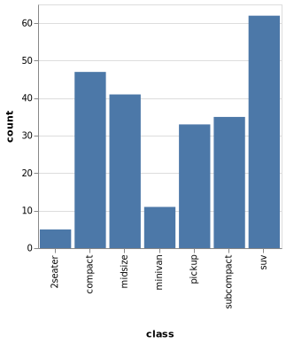

</td>

</tr>

</table>

</div>

<div>

<details>

<summary>JSON specifications</summary>

<table>

<thead>

<tr style="border-width: 0px;">

<td style="width:50%; border-width: 0px;">

ggspec

</td>

<td style="width:50%; border-width: 0px;">

vegaspec

</td>

</tr>

</thead>

<tbody>

<tr style="border-width: 0px;">

<td style="border-width: 0px; vertical-align: top;">

``` json
{
  "data": {
    "data-00": {
      "metadata": {
        "manufacturer": {
          "type": "nominal"
        },
        "model": {
          "type": "nominal"
        },
        "displ": {
          "type": "quantitative"
        },
        "year": {
          "type": "quantitative"
        },
        "cyl": {
          "type": "quantitative"
        },
        "trans": {
          "type": "nominal"
        },
        "drv": {
          "type": "nominal"
        },
        "cty": {
          "type": "quantitative"
        },
        "hwy": {
          "type": "quantitative"
        },
        "fl": {
          "type": "nominal"
        },
        "class": {
          "type": "nominal"
        }
      },
      "observations": [
        {
          "manufacturer": "audi",
          "model": "a4",
          "displ": 1.8,
          "year": 1999,
          "cyl": 4,
          "trans": "auto(l5)",
          "drv": "f",
          "cty": 18,
          "hwy": 29,
          "fl": "p",
          "class": "compact"
        }
      ]
    }
  },
  "layers": [
    {
      "data": "data-00",
      "geom": {
        "class": "GeomBar"
      },
      "geom_params": {
        "na.rm": false
      },
      "mapping": {
        "x": {
          "field": "class"
        }
      },
      "aes_params": {},
      "stat": {
        "class": "StatCount",
        "default_aes": {
          "y": {
            "stat": "count"
          },
          "weight": 1
        }
      },
      "stat_params": {
        "na.rm": false
      },
      "position": {
        "class": "PositionStack"
      }
    }
  ],
  "scales": [],
  "labels": {
    "x": "class",
    "y": "count",
    "weight": "weight"
  },
  "coordinates": {
    "class": "CoordCartesian"
  },
  "facet": {
    "class": "FacetNull"
  }
}
```

</td>

<td style="border-width: 0px; vertical-align: top;">

``` json
{
  "$schema": "https://vega.github.io/schema/vega-lite/v3.json",
  "datasets": {
    "data-00": [
      {
        "manufacturer": "audi",
        "model": "a4",
        "displ": 1.8,
        "year": 1999,
        "cyl": 4,
        "trans": "auto(l5)",
        "drv": "f",
        "cty": 18,
        "hwy": 29,
        "fl": "p",
        "class": "compact"
      }
    ]
  },
  "layer": [
    {
      "data": {
        "name": "data-00"
      },
      "mark": {
        "type": "bar"
      },
      "encoding": {
        "x": {
          "field": "class",
          "type": "nominal",
          "title": "class"
        },
        "y": {
          "aggregate": "count",
          "stack": "zero",
          "type": "quantitative",
          "title": "count"
        }
      }
    }
  ]
}
```

</td>

</tr>

</tbody>

</table>

</details>

</div>

One thing to note is that the `stat` contains a `default_aes` elementm
which we would use in the absence of an explicit aesthetic-mapping for
`y`:

``` r
g <- last_plot()

g$layers[[1]]$stat$default_aes
```

    ## Aesthetic mapping: 
    ## * `y`      -> `stat(count)`
    ## * `weight` -> 1

For example, we could define the aesthetic mapping for `y`:

``` r
  g <- ggplot(data = mpg, aes(x = class, y = stat(count) + 100)) +
  geom_bar()

  g
```

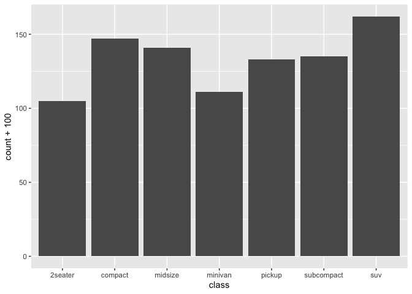<!-- -->

This formulation specifies an aesthetic mapping using (what we call) a
`stat_expression`, which we do not yet support.

``` r
g$mapping$y
```

    ## <quosure>
    ## expr: ^stat(count) + 100
    ## env:  global

However, we would be able to support (once we support `StatBin`)
specifying the type of stat explicitly, using its `default_aes`.

``` r
g <- ggplot(data = mpg, aes(x = displ)) +
  geom_bar(stat = "bin")

g
```

    ## `stat_bin()` using `bins = 30`. Pick better value with `binwidth`.

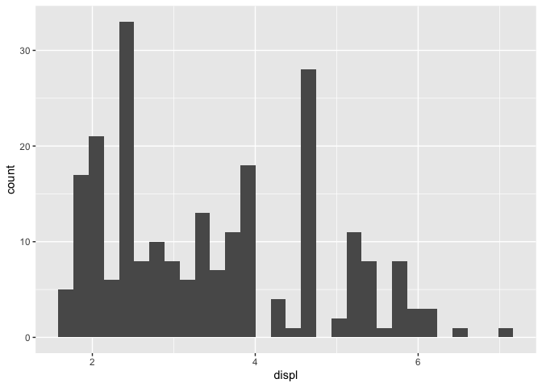<!-- -->

In short, for now I think that we can use only the `default_aes` for the
`y` aesthetic, but we need to keep in mind that it could be overriden by
a `stat_expression` in the future. We will have to handle the `weight`
aesthetic as a `field`.

What can we do now to support `stat(count)` in the mapping?

### Translation

For `StatCount`, we build a `y` encoding:

  - add `type: "quantitative"`
  - if `weight` is a value, add `agg: "count"`
  - if `weight` is a field, add `agg: "sum", field: "<field>"`

For `PositionStack`, we add to the `y` encoding:

  - `stack: "zero"`

For `PositionFill`, we add to the `y` encoding:

  - `stack: "normalize"`

We should also note that the functions `position_stack()` and
`position_fill()` each have two parameters:

  - `vjust`: numeric, default `1`
  - `reverse`: logical, default `FALSE`

For the time being, we will not handle these parameters. (I suspect that
we can use vjust only with `geom_text()`, so I don’t look forward to
having to handle that interaction between `Geom` and `Position`)

It seems we have more examples to handle:

## Stacked bar-chart

``` r
ggv_dev_display("barchart-stacked-mpg")
```

<div>

``` r
  ggplot(data = mpg, aes(x = class)) +
  geom_bar(aes(fill = drv))
```

</div>

<div>

<table>

<tr style="border-width: 0px;">

<td style="border-width: 0px; vertical-align: top;">

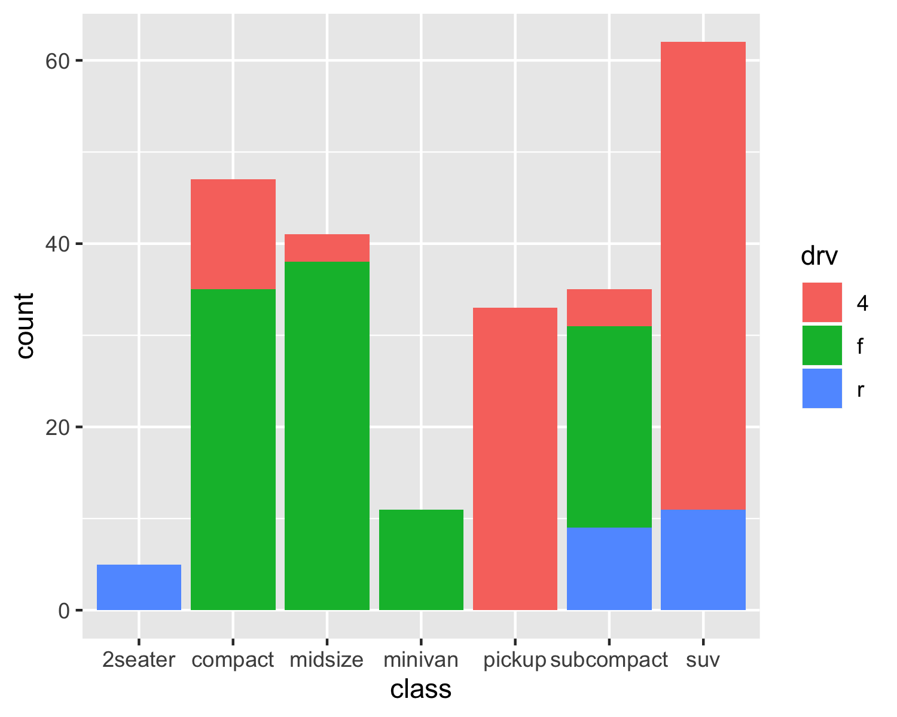

</td>

<td style="border-width: 0px; vertical-align: top;">

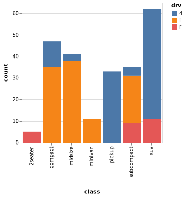

</td>

</tr>

</table>

</div>

<div>

<details>

<summary>JSON specifications</summary>

<table>

<thead>

<tr style="border-width: 0px;">

<td style="width:50%; border-width: 0px;">

ggspec

</td>

<td style="width:50%; border-width: 0px;">

vegaspec

</td>

</tr>

</thead>

<tbody>

<tr style="border-width: 0px;">

<td style="border-width: 0px; vertical-align: top;">

``` json
{
  "data": {
    "data-00": {
      "metadata": {
        "manufacturer": {
          "type": "nominal"
        },
        "model": {
          "type": "nominal"
        },
        "displ": {
          "type": "quantitative"
        },
        "year": {
          "type": "quantitative"
        },
        "cyl": {
          "type": "quantitative"
        },
        "trans": {
          "type": "nominal"
        },
        "drv": {
          "type": "nominal"
        },
        "cty": {
          "type": "quantitative"
        },
        "hwy": {
          "type": "quantitative"
        },
        "fl": {
          "type": "nominal"
        },
        "class": {
          "type": "nominal"
        }
      },
      "observations": [
        {
          "manufacturer": "audi",
          "model": "a4",
          "displ": 1.8,
          "year": 1999,
          "cyl": 4,
          "trans": "auto(l5)",
          "drv": "f",
          "cty": 18,
          "hwy": 29,
          "fl": "p",
          "class": "compact"
        }
      ]
    }
  },
  "layers": [
    {
      "data": "data-00",
      "geom": {
        "class": "GeomBar"
      },
      "geom_params": {
        "na.rm": false
      },
      "mapping": {
        "x": {
          "field": "class"
        },
        "fill": {
          "field": "drv"
        }
      },
      "aes_params": {},
      "stat": {
        "class": "StatCount",
        "default_aes": {
          "y": {
            "stat": "count"
          },
          "weight": 1
        }
      },
      "stat_params": {
        "na.rm": false
      },
      "position": {
        "class": "PositionStack"
      }
    }
  ],
  "scales": [],
  "labels": {
    "fill": "drv",
    "x": "class",
    "y": "count",
    "weight": "weight"
  },
  "coordinates": {
    "class": "CoordCartesian"
  },
  "facet": {
    "class": "FacetNull"
  }
}
```

</td>

<td style="border-width: 0px; vertical-align: top;">

``` json
{
  "$schema": "https://vega.github.io/schema/vega-lite/v3.json",
  "datasets": {
    "data-00": [
      {
        "manufacturer": "audi",
        "model": "a4",
        "displ": 1.8,
        "year": 1999,
        "cyl": 4,
        "trans": "auto(l5)",
        "drv": "f",
        "cty": 18,
        "hwy": 29,
        "fl": "p",
        "class": "compact"
      }
    ]
  },
  "layer": [
    {
      "data": {
        "name": "data-00"
      },
      "mark": {
        "type": "bar"
      },
      "encoding": {
        "x": {
          "field": "class",
          "type": "nominal",
          "title": "class"
        },
        "y": {
          "aggregate": "count",
          "stack": "zero",
          "type": "quantitative",
          "title": "count"
        },
        "fill": {
          "field": "drv",
          "type": "nominal",
          "title": "drv"
        }
      }
    }
  ]
}
```

</td>

</tr>

</tbody>

</table>

</details>

</div>

## Weighted bar-chart

``` r
ggv_dev_display("barchart-weighted-mpg")
```

<div>

``` r
  ggplot(data = mpg, aes(x = class, weight = displ)) +
  geom_bar()
```

</div>

<div>

<table>

<tr style="border-width: 0px;">

<td style="border-width: 0px; vertical-align: top;">

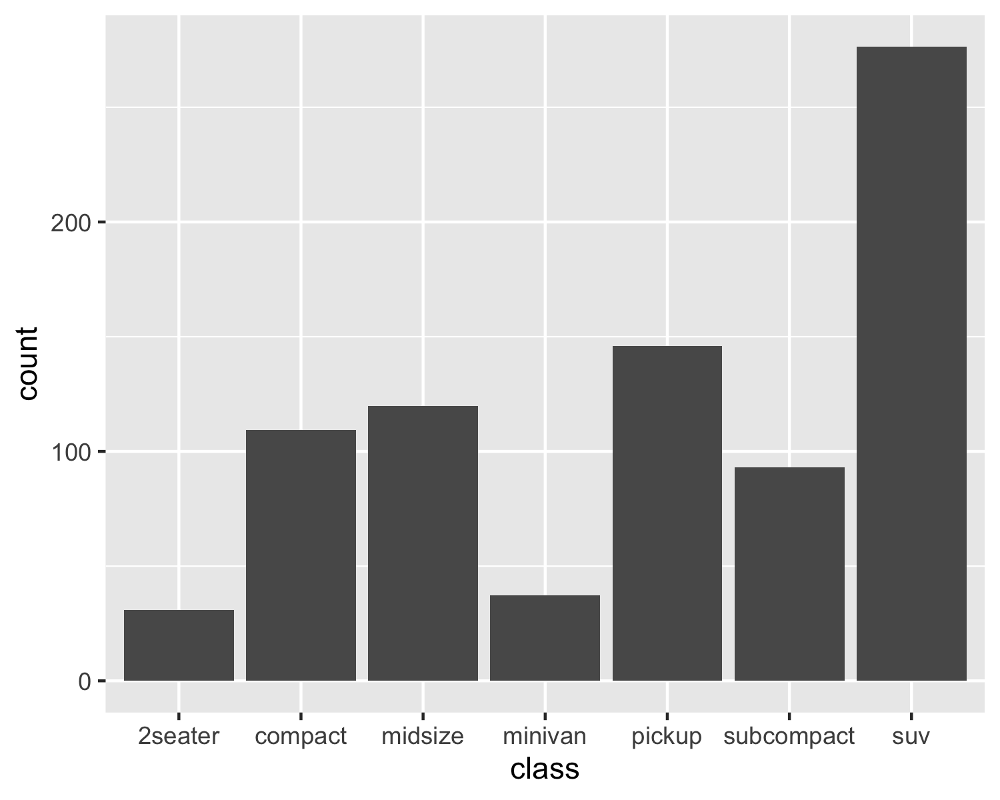

</td>

<td style="border-width: 0px; vertical-align: top;">

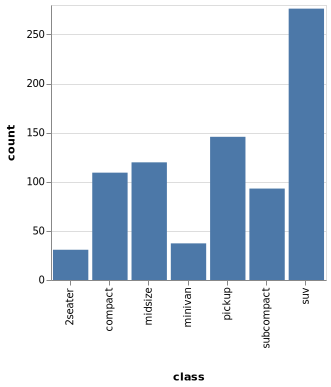

</td>

</tr>

</table>

</div>

<div>

<details>

<summary>JSON specifications</summary>

<table>

<thead>

<tr style="border-width: 0px;">

<td style="width:50%; border-width: 0px;">

ggspec

</td>

<td style="width:50%; border-width: 0px;">

vegaspec

</td>

</tr>

</thead>

<tbody>

<tr style="border-width: 0px;">

<td style="border-width: 0px; vertical-align: top;">

``` json
{
  "data": {
    "data-00": {
      "metadata": {
        "manufacturer": {
          "type": "nominal"
        },
        "model": {
          "type": "nominal"
        },
        "displ": {
          "type": "quantitative"
        },
        "year": {
          "type": "quantitative"
        },
        "cyl": {
          "type": "quantitative"
        },
        "trans": {
          "type": "nominal"
        },
        "drv": {
          "type": "nominal"
        },
        "cty": {
          "type": "quantitative"
        },
        "hwy": {
          "type": "quantitative"
        },
        "fl": {
          "type": "nominal"
        },
        "class": {
          "type": "nominal"
        }
      },
      "observations": [
        {
          "manufacturer": "audi",
          "model": "a4",
          "displ": 1.8,
          "year": 1999,
          "cyl": 4,
          "trans": "auto(l5)",
          "drv": "f",
          "cty": 18,
          "hwy": 29,
          "fl": "p",
          "class": "compact"
        }
      ]
    }
  },
  "layers": [
    {
      "data": "data-00",
      "geom": {
        "class": "GeomBar"
      },
      "geom_params": {
        "na.rm": false
      },
      "mapping": {
        "x": {
          "field": "class"
        },
        "weight": {
          "field": "displ"
        }
      },
      "aes_params": {},
      "stat": {
        "class": "StatCount",
        "default_aes": {
          "y": {
            "stat": "count"
          },
          "weight": 1
        }
      },
      "stat_params": {
        "na.rm": false
      },
      "position": {
        "class": "PositionStack"
      }
    }
  ],
  "scales": [],
  "labels": {
    "x": "class",
    "y": "count",
    "weight": "displ"
  },
  "coordinates": {
    "class": "CoordCartesian"
  },
  "facet": {
    "class": "FacetNull"
  }
}
```

</td>

<td style="border-width: 0px; vertical-align: top;">

``` json
{
  "$schema": "https://vega.github.io/schema/vega-lite/v3.json",
  "datasets": {
    "data-00": [
      {
        "manufacturer": "audi",
        "model": "a4",
        "displ": 1.8,
        "year": 1999,
        "cyl": 4,
        "trans": "auto(l5)",
        "drv": "f",
        "cty": 18,
        "hwy": 29,
        "fl": "p",
        "class": "compact"
      }
    ]
  },
  "layer": [
    {
      "data": {
        "name": "data-00"
      },
      "mark": {
        "type": "bar"
      },
      "encoding": {
        "x": {
          "field": "class",
          "type": "nominal",
          "title": "class"
        },
        "y": {
          "aggregate": "sum",
          "field": "displ",
          "stack": "zero",
          "type": "quantitative",
          "title": "count"
        }
      }
    }
  ]
}
```

</td>

</tr>

</tbody>

</table>

</details>

</div>

## Normalized bar-chart

``` r
ggv_dev_display("barchart-normalized-mpg")
```

<div>

``` r
  ggplot(data = mpg, aes(x = class)) +
  geom_bar(aes(fill = drv), position = "fill")
```

</div>

<div>

<table>

<tr style="border-width: 0px;">

<td style="border-width: 0px; vertical-align: top;">

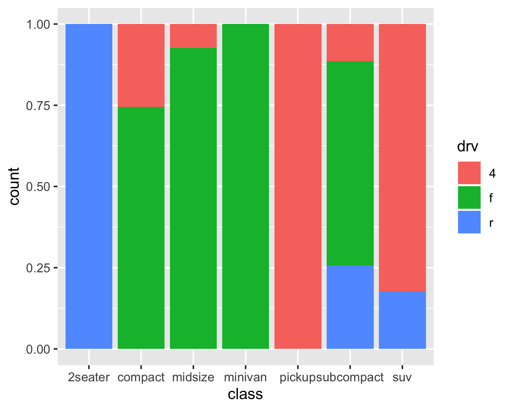

</td>

<td style="border-width: 0px; vertical-align: top;">

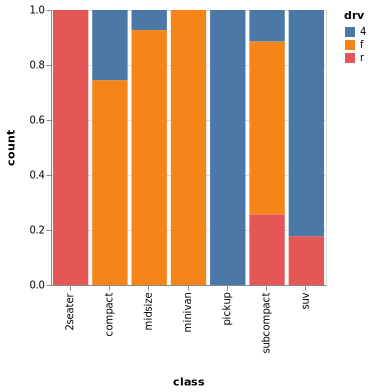

</td>

</tr>

</table>

</div>

<div>

<details>

<summary>JSON specifications</summary>

<table>

<thead>

<tr style="border-width: 0px;">

<td style="width:50%; border-width: 0px;">

ggspec

</td>

<td style="width:50%; border-width: 0px;">

vegaspec

</td>

</tr>

</thead>

<tbody>

<tr style="border-width: 0px;">

<td style="border-width: 0px; vertical-align: top;">

``` json
{
  "data": {
    "data-00": {
      "metadata": {
        "manufacturer": {
          "type": "nominal"
        },
        "model": {
          "type": "nominal"
        },
        "displ": {
          "type": "quantitative"
        },
        "year": {
          "type": "quantitative"
        },
        "cyl": {
          "type": "quantitative"
        },
        "trans": {
          "type": "nominal"
        },
        "drv": {
          "type": "nominal"
        },
        "cty": {
          "type": "quantitative"
        },
        "hwy": {
          "type": "quantitative"
        },
        "fl": {
          "type": "nominal"
        },
        "class": {
          "type": "nominal"
        }
      },
      "observations": [
        {
          "manufacturer": "audi",
          "model": "a4",
          "displ": 1.8,
          "year": 1999,
          "cyl": 4,
          "trans": "auto(l5)",
          "drv": "f",
          "cty": 18,
          "hwy": 29,
          "fl": "p",
          "class": "compact"
        }
      ]
    }
  },
  "layers": [
    {
      "data": "data-00",
      "geom": {
        "class": "GeomBar"
      },
      "geom_params": {
        "na.rm": false
      },
      "mapping": {
        "x": {
          "field": "class"
        },
        "fill": {
          "field": "drv"
        }
      },
      "aes_params": {},
      "stat": {
        "class": "StatCount",
        "default_aes": {
          "y": {
            "stat": "count"
          },
          "weight": 1
        }
      },
      "stat_params": {
        "na.rm": false
      },
      "position": {
        "class": "PositionFill"
      }
    }
  ],
  "scales": [],
  "labels": {
    "fill": "drv",
    "x": "class",
    "y": "count",
    "weight": "weight"
  },
  "coordinates": {
    "class": "CoordCartesian"
  },
  "facet": {
    "class": "FacetNull"
  }
}
```

</td>

<td style="border-width: 0px; vertical-align: top;">

``` json
{
  "$schema": "https://vega.github.io/schema/vega-lite/v3.json",
  "datasets": {
    "data-00": [
      {
        "manufacturer": "audi",
        "model": "a4",
        "displ": 1.8,
        "year": 1999,
        "cyl": 4,
        "trans": "auto(l5)",
        "drv": "f",
        "cty": 18,
        "hwy": 29,
        "fl": "p",
        "class": "compact"
      }
    ]
  },
  "layer": [
    {
      "data": {
        "name": "data-00"
      },
      "mark": {
        "type": "bar"
      },
      "encoding": {
        "x": {
          "field": "class",
          "type": "nominal",
          "title": "class"
        },
        "y": {
          "aggregate": "count",
          "stack": "normalize",
          "type": "quantitative",
          "title": "count"
        },
        "fill": {
          "field": "drv",
          "type": "nominal",
          "title": "drv"
        }
      }
    }
  ]
}
```

</td>

</tr>

</tbody>

</table>

</details>

</div>

## Flipped, stacked, weighted, normalized, bar-chart

``` r
ggv_dev_display("barchart-flipped-weighted-normalized-mpg")
```

<div>

``` r
  ggplot(data = mpg, aes(x = class, weight = displ)) +
  geom_bar(aes(fill = drv), position = "fill") +
  coord_flip()
```

</div>

<div>

<table>

<tr style="border-width: 0px;">

<td style="border-width: 0px; vertical-align: top;">

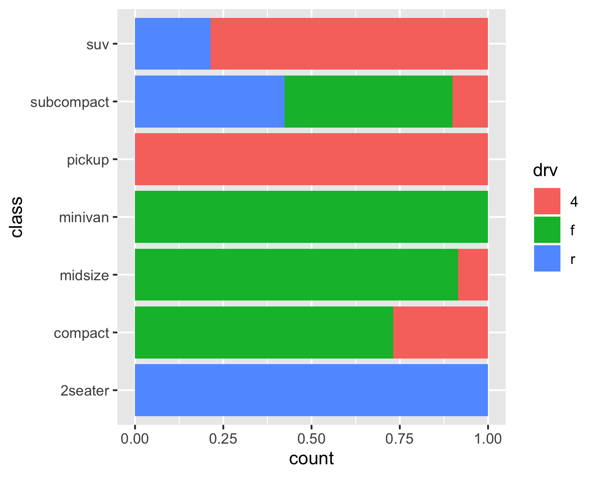

</td>

<td style="border-width: 0px; vertical-align: top;">

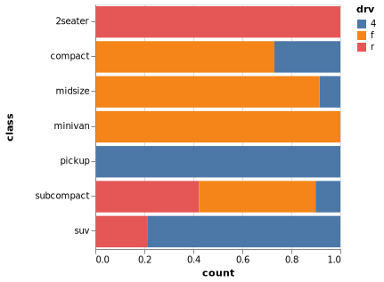

</td>

</tr>

</table>

</div>

<div>

<details>

<summary>JSON specifications</summary>

<table>

<thead>

<tr style="border-width: 0px;">

<td style="width:50%; border-width: 0px;">

ggspec

</td>

<td style="width:50%; border-width: 0px;">

vegaspec

</td>

</tr>

</thead>

<tbody>

<tr style="border-width: 0px;">

<td style="border-width: 0px; vertical-align: top;">

``` json
{
  "data": {
    "data-00": {
      "metadata": {
        "manufacturer": {
          "type": "nominal"
        },
        "model": {
          "type": "nominal"
        },
        "displ": {
          "type": "quantitative"
        },
        "year": {
          "type": "quantitative"
        },
        "cyl": {
          "type": "quantitative"
        },
        "trans": {
          "type": "nominal"
        },
        "drv": {
          "type": "nominal"
        },
        "cty": {
          "type": "quantitative"
        },
        "hwy": {
          "type": "quantitative"
        },
        "fl": {
          "type": "nominal"
        },
        "class": {
          "type": "nominal"
        }
      },
      "observations": [
        {
          "manufacturer": "audi",
          "model": "a4",
          "displ": 1.8,
          "year": 1999,
          "cyl": 4,
          "trans": "auto(l5)",
          "drv": "f",
          "cty": 18,
          "hwy": 29,
          "fl": "p",
          "class": "compact"
        }
      ]
    }
  },
  "layers": [
    {
      "data": "data-00",
      "geom": {
        "class": "GeomBar"
      },
      "geom_params": {
        "na.rm": false
      },
      "mapping": {
        "x": {
          "field": "class"
        },
        "fill": {
          "field": "drv"
        },
        "weight": {
          "field": "displ"
        }
      },
      "aes_params": {},
      "stat": {
        "class": "StatCount",
        "default_aes": {
          "y": {
            "stat": "count"
          },
          "weight": 1
        }
      },
      "stat_params": {
        "na.rm": false
      },
      "position": {
        "class": "PositionFill"
      }
    }
  ],
  "scales": [],
  "labels": {
    "fill": "drv",
    "x": "class",
    "y": "count",
    "weight": "displ"
  },
  "coordinates": {
    "class": "CoordFlip"
  },
  "facet": {
    "class": "FacetNull"
  }
}
```

</td>

<td style="border-width: 0px; vertical-align: top;">

``` json
{
  "$schema": "https://vega.github.io/schema/vega-lite/v3.json",
  "datasets": {
    "data-00": [
      {
        "manufacturer": "audi",
        "model": "a4",
        "displ": 1.8,
        "year": 1999,
        "cyl": 4,
        "trans": "auto(l5)",
        "drv": "f",
        "cty": 18,
        "hwy": 29,
        "fl": "p",
        "class": "compact"
      }
    ]
  },
  "layer": [
    {
      "data": {
        "name": "data-00"
      },
      "mark": {
        "type": "bar"
      },
      "encoding": {
        "y": {
          "field": "class",
          "type": "nominal",
          "title": "class"
        },
        "x": {
          "aggregate": "sum",
          "field": "displ",
          "stack": "normalize",
          "type": "quantitative",
          "title": "count"
        },
        "fill": {
          "field": "drv",
          "type": "nominal",
          "title": "drv"
        }
      }
    }
  ]
}
```

</td>

</tr>

</tbody>

</table>

</details>

</div>
