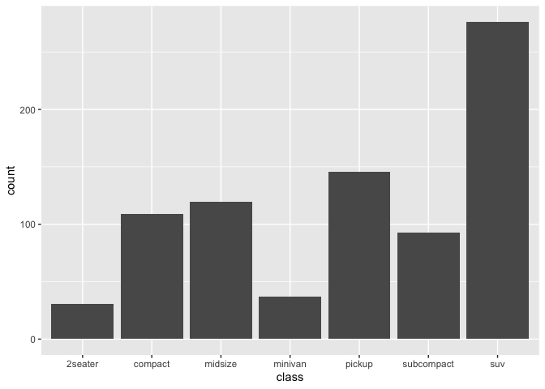
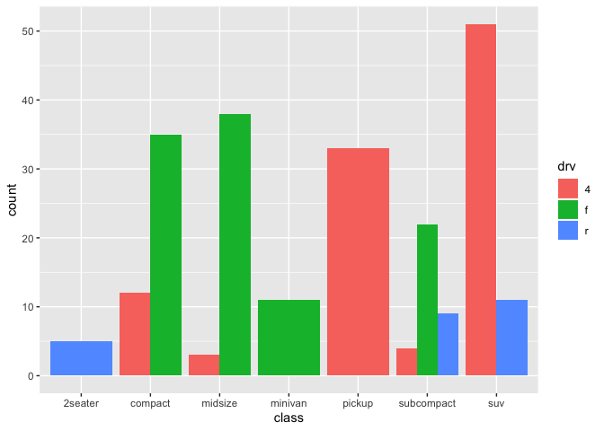
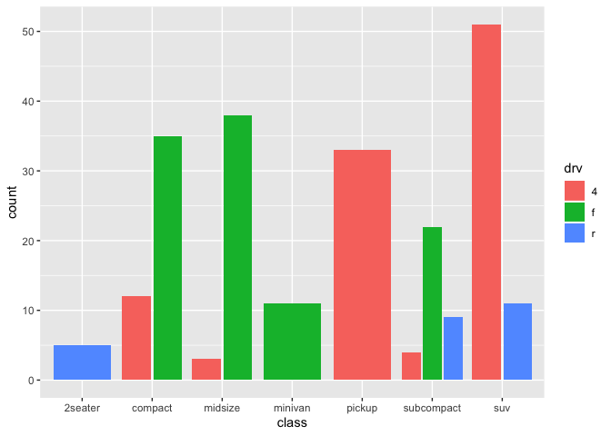
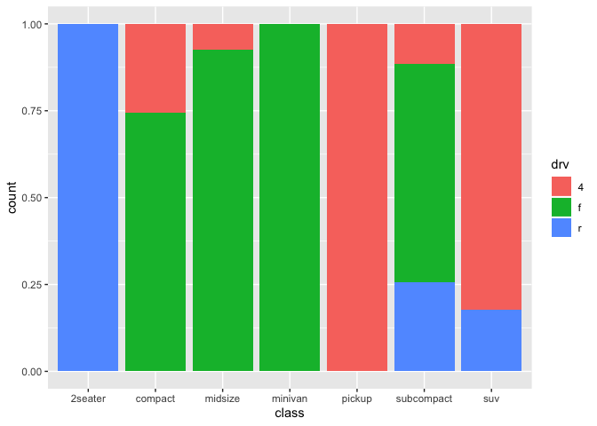

Histograms & Bar Charts
================

### Histograms in ggplot2

`geom_histogram()` displays the counts with bars and uses `stat_bin()`
by default.

  - `stat_bin()` is suitable only for continuous x data.

  - `stat_count()` can be used if the x data is discrete.

`geom_histogram()` uses the same aesthetics as `geom_bar()`

### Histograms in Vega-Lite

Binning can be done in either encoding or transform. It is also an
option to use data that is already binned.

The additions to be noted are `"bin": true` to the x encoding and the
`"aggregate": "count"` to the y encoding.

    {
      "data": {},
      "mark": "bar",
      "encoding": {
        "x": {
          "bin": true,
          "field": "",
          "type": "quantitative"
        },
        "y": {
          "aggregate": "count",
          "type": "quantitative"
        }
      }
    }

### Histograms in ggspec

A first idea for how a stat would appear in a ggspec layer.

    {
      "layer": {
        "aes_params": {},
        "data": "",
        "geom": {
          "class": "GeomBar",
        },
        "geom_params":{
          "na.rm": FALSE
        },
        "mapping":{
          "x": {"field": ""},
          "weight": {"value": 1}
        },
        "position": {
          "class": "PositionStack",
        },
        "stat": {
          "class": "StatBin",
          "default_aes": {
            "y": {"stat_operation": "count"},
            "weight": {"value": 1}
          },
          "required_aes": ["x"]
        },
        "stat_params": {
          "binwidth": NULL,
          "bins": NULL,
          "na.rm": FALSE,
          "pad": FALSE
        }
      }
    }

Note that `weight` could be mapped to a variable instead of a constant
and that the content of `stat_params` would depend on the class of the
`stat`

### Histogram examples

##### A simple histogram

In ggplot2:

``` r
p <- ggplot(diamonds, aes(carat)) +
  geom_histogram()
p
```

    ## `stat_bin()` using `bins = 30`. Pick better value with `binwidth`.

<!-- -->

In Vega-Lite:

``` r
list(
  `$schema` = vega_schema(), 
  data = list(values = diamonds),
  mark = "bar",
  encoding = list(
    x = list(bin = list(maxbins = 30), field = "carat", type = "quantitative"),
    y = list(aggregate = "count", type = "quantitative")
  )
) %>% 
  as_vegaspec()
```

<!-- -->

In ggspec:

``` r
sp <- gg2spec(p)

sp$data[[1]]$observations <- sp$data[[1]]$observations[[1]]
str(sp$layers)
```

    ## List of 1
    ##  $ :List of 8
    ##   ..$ aes_params : Named list()
    ##   ..$ data       : chr "data-00"
    ##   ..$ geom       :List of 1
    ##   .. ..$ class: chr "GeomBar"
    ##   ..$ geom_params:List of 1
    ##   .. ..$ na.rm: logi FALSE
    ##   ..$ mapping    :List of 1
    ##   .. ..$ x:List of 1
    ##   .. .. ..$ field: chr "carat"
    ##   ..$ position   :List of 1
    ##   .. ..$ class: chr "PositionStack"
    ##   ..$ stat       :List of 3
    ##   .. ..$ class       : chr "StatBin"
    ##   .. ..$ default_aes :List of 2
    ##   .. .. ..$ y     :List of 1
    ##   .. .. .. ..$ stat: chr "count"
    ##   .. .. ..$ weight:List of 1
    ##   .. .. .. ..$ value: num 1
    ##   .. ..$ required_aes: chr "x"
    ##   ..$ stat_params:List of 4
    ##   .. ..$ binwidth: NULL
    ##   .. ..$ bins    : NULL
    ##   .. ..$ na.rm   : logi FALSE
    ##   .. ..$ pad     : logi FALSE

## Bar charts

### Bar charts in ggplot2

There are two types of bar charts in ggplot2: `geom_bar()` and
`geom_col()`.

  - `geom_bar()` makes the height of the bar proportional to the number
    of cases in each group (or if the `weight` aesthetic is supplied,
    the sum of the weights).
    
      - uses `stat_count()` by default: it counts the number of cases at
        each x position

  - `geom_col()` makes the heights of the bars to represent values in
    the data.
    
      - uses `stat_identity()` by default: it leaves the data as is.

### Bar charts in Vega-Lite

The important addition to be noted is the `"aggregate": "count"` added
to the y encoding.

    {
      "data": {},
      "mark": "bar",
      "encoding": {
        "x": {
          "field": "",
          "type": "nominal" 
        },
        "y": {
          "aggregate": "count",
          "type": "quantitative"
        }
      }
    }

If a weighting variable is used in ggplot2, then we would specify the
variable name as the field in the y encoding and the aggregate function
is now `sum` instead of `count`.

    {
      "data": {},
      "mark": "bar",
      "encoding": {
        "x": {
          "field": "",
          "type": "nominal" 
        },
        "y": {
          "aggregate": "sum",
          "field": "",
          "type": "quantitative"
        }
      }
    }

### Bar chart examples

##### A bar chart

``` r
ggplot(mpg, aes(class)) + geom_bar()
```

<!-- -->

``` r
list(
  `$schema` = vega_schema(), 
  data = list(values = mpg),
  mark = "bar",
  encoding = list(
    x = list(field = "class", type = "nominal"),
    y = list(aggregate = "count", type = "quantitative")
  )
) %>% 
  as_vegaspec()
```

<!-- -->

<br/>

##### A bar chart with a weight variable

``` r
ggplot(mpg, aes(class)) + geom_bar(aes(weight = displ))
```

<!-- -->

``` r
list(
  `$schema` = vega_schema(), 
  data = list(values = mpg),
  mark = "bar",
  encoding = list(
    x = list(field = "class", type = "nominal"),
    y = list(aggregate = "sum", field = "displ", type = "quantitative")
  )
) %>% 
  as_vegaspec()
```

<!-- -->

<br/>

##### A stacked bar chart

``` r
ggplot(mpg, aes(class)) + geom_bar(aes(fill = drv))
```

<!-- -->

``` r
list(
  `$schema` = vega_schema(), 
  data = list(values = mpg),
  mark = "bar",
  encoding = list(
    x = list(field = "class", type = "nominal"),
    y = list(aggregate = "count", type = "quantitative"),
    color = list(field = "drv", type = "nominal")
  )
) %>% 
  as_vegaspec()
```

<!-- -->

<br/>

##### A flipped stacked bar chart

``` r
ggplot(mpg, aes(class)) +
 geom_bar(aes(fill = drv)) +
 coord_flip() +
 theme(legend.position = "top")
```

<!-- -->

``` r
list(
  `$schema` = vega_schema(), 
  data = list(values = mpg),
  mark = "bar",
  encoding = list(
    y = list(field = "class", type = "nominal"),
    x = list(aggregate = "count", type = "quantitative"),
    color = list(field = "drv", type = "nominal")
  )
) %>% 
  as_vegaspec()
```

<!-- -->

<br/>

##### A grouped bar chart using `position_dodge()`

``` r
ggplot(mpg, aes(class)) + geom_bar(aes(fill = drv), position = position_dodge())
```

<!-- -->

<br/>

##### A grouped bar chart using `position_dodge2()`

``` r
ggplot(mpg, aes(class)) + geom_bar(aes(fill = drv), position = position_dodge2())
```

<!-- -->

``` r
list(
  `$schema` = vega_schema(), 
  data = list(values = mpg),
  mark = "bar",
  encoding = list(
    column = list(field = "class", type = "nominal"),
    x = list(field = "drv", type = "nominal",
      scale = list(rangeStep = 12),
      axis =  list(title = "")),
    y = list(aggregate = "count", type = "quantitative"),
    color = list(field = "drv", type = "nominal")
  ),
  config = list(
    view = list(stroke = "transparent"),
    axis = list(domainWidth = 1)
  ),
  spacing = 6
) %>% 
  as_vegaspec()
```

<!-- -->

<br/>

##### A normalized bar chart (showing proportions) using `position_fill()`

``` r
ggplot(mpg, aes(class)) + geom_bar(aes(fill = drv), position = position_fill())
```

<!-- -->

``` r
list(
  `$schema` = vega_schema(), 
  data = list(values = mpg),
  mark = "bar",
  encoding = list(
    x = list(field = "class", type = "nominal"),
    y = list(aggregate = "count", type = "quantitative", stack = "normalize"),
    color = list(field = "drv", type = "nominal")
  )
) %>% 
  as_vegaspec()
```

<!-- -->

<br/>

##### An ordered bar chart

<br/>

### Next steps

How to translate stat params?
