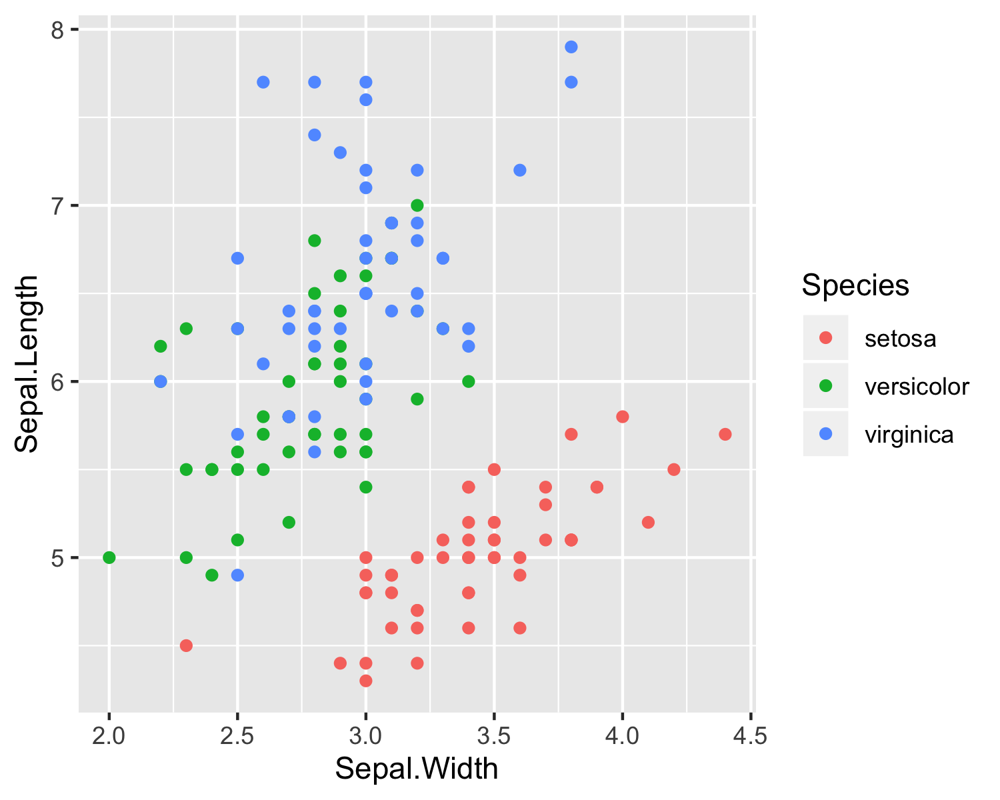
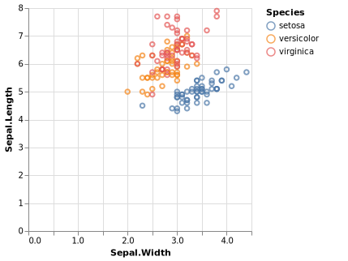

scatterplot
================

``` r
library("ggvega")
library("ggplot2")
library("vegawidget")
```

``` r
ggplot(iris, aes(x = Sepal.Width, y = Sepal.Length)) +
  geom_point(aes(color = Species))
```




<div>

<details>

<summary>JSON specifications</summary>

<table>

<thead>

<tr style="border-width: 0px;">

<td style="width:50%; border-width: 0px;">

ggspec

</td>

<td style="width:50%; border-width: 0px;">

vegaspec

</td>

</tr>

</thead>

<tbody>

<tr style="border-width: 0px;">

<td style="border-width: 0px; vertical-align: top;">

``` json
{
  "data": {
    "data-00": {
      "metadata": {
        "Sepal.Length": {
          "type": "quantitative"
        },
        "Sepal.Width": {
          "type": "quantitative"
        },
        "Petal.Length": {
          "type": "quantitative"
        },
        "Petal.Width": {
          "type": "quantitative"
        },
        "Species": {
          "type": "nominal",
          "levels": [
            "setosa",
            "versicolor",
            "virginica"
          ]
        }
      },
      "observations": [
        {
          "Sepal.Length": 5.1,
          "Sepal.Width": 3.5,
          "Petal.Length": 1.4,
          "Petal.Width": 0.2,
          "Species": "setosa"
        }
      ]
    }
  },
  "layers": [
    {
      "data": "data-00",
      "geom": {
        "class": "GeomPoint"
      },
      "geom_params": {
        "na.rm": false
      },
      "mapping": {
        "x": {
          "field": "Sepal.Width"
        },
        "y": {
          "field": "Sepal.Length"
        },
        "colour": {
          "field": "Species"
        }
      },
      "aes_params": {},
      "stat": {
        "class": "StatIdentity"
      },
      "stat_params": {
        "na.rm": false
      }
    }
  ],
  "scales": [],
  "labels": {
    "x": "Sepal.Width",
    "y": "Sepal.Length",
    "colour": "Species"
  },
  "coordinates": {
    "class": "CoordCartesian"
  },
  "facet": {
    "class": "FacetNull"
  }
}
```

</td>

<td style="border-width: 0px; vertical-align: top;">

``` json
{
  "$schema": "https://vega.github.io/schema/vega-lite/v3.json",
  "datasets": {
    "data-00": [
      {
        "Sepal.Length": 5.1,
        "Sepal.Width": 3.5,
        "Petal.Length": 1.4,
        "Petal.Width": 0.2,
        "Species": "setosa"
      }
    ]
  },
  "layer": [
    {
      "data": {
        "name": "data-00"
      },
      "mark": "point",
      "encoding": {
        "x": {
          "field": "Sepal\\.Width",
          "type": "quantitative",
          "title": "Sepal.Width"
        },
        "y": {
          "field": "Sepal\\.Length",
          "type": "quantitative",
          "title": "Sepal.Length"
        },
        "stroke": {
          "field": "Species",
          "type": "nominal",
          "title": "Species"
        }
      }
    }
  ]
}
```

</td>

</tr>

</tbody>

</table>

</details>

</div>
