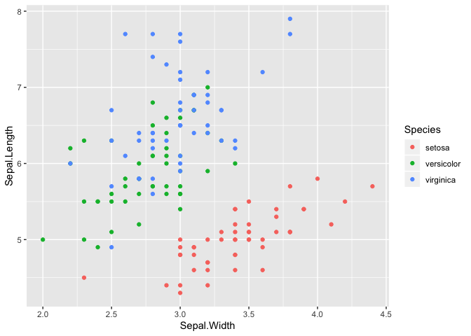

scatterplot
================

``` r
library("ggvega")
library("ggplot2")
```

``` r
ggplot(iris, aes(x = Sepal.Width, y = Sepal.Length)) +
  geom_point(aes(color = Species))
```

``` r
g
```

<!-- -->
