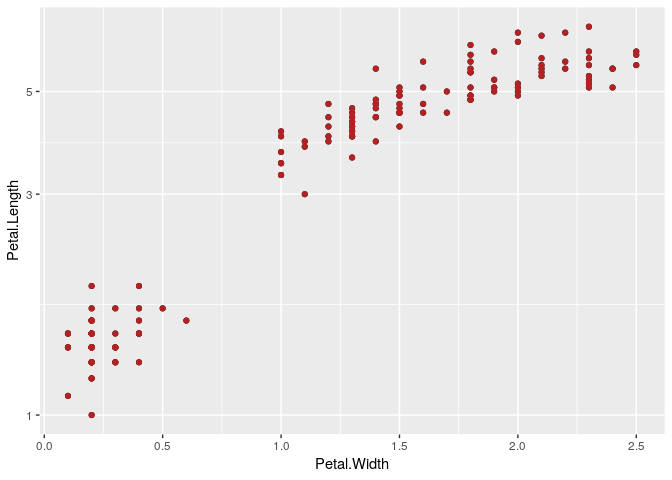

First components of the ggspec function
================

<br/>

## Extracting elements

<br/>

``` r
p <- ggplot(data = iris) + 
  geom_point(aes(x = Petal.Width, y = Petal.Length)) + 
  geom_point(aes(x = Petal.Width, y = Petal.Length, color = Species), shape = 21, fill = "white") +
  scale_y_log10()

p
```

<!-- -->

<br/>

### Extracting data

The first move will be to create the list `data` where all of the data
will live.

<!-- QUESTION: what to do about `waiver()` objects? -->

#### Intermediate data step

`data_int()` will create an intermediate-form for the data. The inputs
are the plot data and the plot layers. The result is a named list of
datasets, named `data-00`, `data-01`, …, where each list contains the
elements `metadata`, `variables`, and `hash`.

**TO - DO**:

  - Need to name the datasets but will need to check for matching
    hashsums and remove `NULL`s
      - Would like only the default data to be able to be named
        `data-00`  
      - The other data sets will be named `data-01`, `data-02`, and so
        on.  
  - `metadata` will be a named list (names are variable names) of 3 (1
    required, 2 optional)
      - `type` = variable type (required)
      - `levels` = levels of factor (optional)
      - `timezone` = timezone of `date` or `POSIXct` (optional)

<!-- end list -->

``` r
name_data <- function(dat) {
  # check for any matching hashsums
}

data_int <- function(data_plt, layers_plt) {
  #join together default data and layer data
  data_all <- append(list(data_plt), purrr::map(layers_plt, purrr::pluck, "data"))
  
  #format the lists of data
  data_all <- purrr::map(data_all, format_data_int)
  
  # how to name the datasets??
  
  # remove NULL entries 
  data_all <- purrr::discard(data_all, is.null)
  
  
  
  
  data_all
}
```

<br/>

Helper functions:

`format_data_int()` will format each list of data so that it contains:

  - `metadata`: discussed below
  - `variables`: the data frame itself  
  - `hash`: the md5 hash of the data frame

<!-- end list -->

``` r
format_data_int <- function(dat) {
  if(is.waive(dat) || is.null(dat)) return(NULL) 
  else {
    list(
      metadata = purrr::pluck(dat) %>% purrr::map(create_meta_levels),
      variables = dat,
      hash = digest::digest(dat)
    )
  }
}
```

`create_meta_levels()` will create the names list of 3

  - `metadata`: could be a named list, using names of variables:
      - `type`: first pass at `"quantitative"`, …, based on class,
        etc.  
      - `levels`: optional, vector of strings, used for factor-levels  
      - `timezone`: optional, timezone of `date` or `POSIXct`

`case_type_vl()` converts the type into a Vega-lite type

``` r
case_type_vl <- function(type) {
  case_when(
    type == "Date" | type == "POSIXct" ~ "temporal",
    type == "factor" | type == "character" | type == "logical" ~ "nominal",
    type == "ordered" ~ "ordinal",
    type == "numeric" ~ "quantitative"
  )
}

create_meta_levels <- function(dat){
  type = class(dat)
  if(type == "factor" | type == "ordered") {
    meta <- list(
      type = case_type_vl(type),
      levels = levels(dat)
    )
  } else if (type == "date" | type == "POSIXct") {
    meta <- list(
      type = case_type_vl(type),
      timezone = NULL # use lubridate::tz or ??
    )
  } else {
    meta <- list(
      type = case_type_vl(type)
    )
  }
  meta
}
```

<br/>

Example of the function in use:

``` r
test <- data_int(p$data, p$layers)
str(test)
```

    ## List of 1
    ##  $ :List of 3
    ##   ..$ metadata :List of 5
    ##   .. ..$ Sepal.Length:List of 1
    ##   .. .. ..$ type: chr "quantitative"
    ##   .. ..$ Sepal.Width :List of 1
    ##   .. .. ..$ type: chr "quantitative"
    ##   .. ..$ Petal.Length:List of 1
    ##   .. .. ..$ type: chr "quantitative"
    ##   .. ..$ Petal.Width :List of 1
    ##   .. .. ..$ type: chr "quantitative"
    ##   .. ..$ Species     :List of 2
    ##   .. .. ..$ type  : chr "nominal"
    ##   .. .. ..$ levels: chr [1:3] "setosa" "versicolor" "virginica"
    ##   ..$ variables:'data.frame':    150 obs. of  5 variables:
    ##   .. ..$ Sepal.Length: num [1:150] 5.1 4.9 4.7 4.6 5 5.4 4.6 5 4.4 4.9 ...
    ##   .. ..$ Sepal.Width : num [1:150] 3.5 3 3.2 3.1 3.6 3.9 3.4 3.4 2.9 3.1 ...
    ##   .. ..$ Petal.Length: num [1:150] 1.4 1.4 1.3 1.5 1.4 1.7 1.4 1.5 1.4 1.5 ...
    ##   .. ..$ Petal.Width : num [1:150] 0.2 0.2 0.2 0.2 0.2 0.4 0.3 0.2 0.2 0.1 ...
    ##   .. ..$ Species     : Factor w/ 3 levels "setosa","versicolor",..: 1 1 1 1 1 1 1 1 1 1 ...
    ##   ..$ hash     : chr "d3c5d071001b61a9f6131d3004fd0988"

<br/>

This intermediate-form could be used to generate the ggspec-form; it
could also be useful later.

<br/>

#### Final data step

`data_spc()` will return a named list of datasets, named `data-00`,
`data-01`, … . Each list will have:

  - `metadata`, as in `data_int()`  
  - `observations`, transpose of variables

<!-- end list -->

``` r
format_data_spec <- function(dat) {
  list(
    metadata = dat$metadata,
    observations = purrr::transpose(dat$variables)
  )
}

data_spc <- function(data_int) {
  purrr::map(data_int, format_data_spec)
}
```

``` r
str(data_spc(data_int(p$data, p$layers)), max.level = 2)
```

    ## List of 1
    ##  $ :List of 2
    ##   ..$ metadata    :List of 5
    ##   ..$ observations:List of 150

<br/>

### Extracting layers

Within each layer-object, we need:

1.  data (a reference id?)  
2.  geom  
3.  geom\_params (maybe)  
4.  mapping  
5.  aes\_params  
6.  stat (maybe)  
7.  stat\_params (maybe)

<br/>

The ggspec layers are a function of the ggplot layers, but also of the
data:

`layer_spc()` calls `get_layers()` for each layer. `get_layers()`
returns …

  - if `layer_plt` has no data, use `data-00`  
  - if `layer_plt` has data, hash it and compare against `data_int`, use
    name  
  - make sure that the mapping field is a name in the dataset

<!-- end list -->

``` r
layer_spc <- function(layer_plt, int_data) {
  purrr::map(layer_plt, get_layers, int_data)
}
```

<br/>

Helper functions:

``` r
get_layers <- function(layer, int_data) {
  pluck_layer <- purrr::partial(purrr::pluck, .x = layer)
  
  list(
    data = pluck_layer("data") %>% compare_data(int_data),
    geom = list(
      class = pluck_layer("geom", class, 1)
    ),
    mapping = pluck_layer("mapping") %>% purrr::map(get_mappings),
    aes_params = pluck_layer("aes_params"),
    stat = list(
      class = pluck_layer("stat", class, 1)
    )
  )
}
```

``` r
get_mappings <- function(aes) {
  list(field = rlang::get_expr(aes),
       type = NULL
  ) 
}
```

In `compare_data()`:

  - if `layer_plt` has no data, use `data-00`  
  - if `layer_plt` has data, hash it and compare against `data_int`, use
    name  
  - make sure that the mapping field is a name in the dataset

<!-- end list -->

``` r
# 
compare_data <- function(layer_data, plot_data){
  NULL
}
```

<br/>

Example of function being used:

``` r
str(layer_spc(p$layers, test))
```

    ## List of 2
    ##  $ :List of 5
    ##   ..$ data      : NULL
    ##   ..$ geom      :List of 1
    ##   .. ..$ class: chr "GeomPoint"
    ##   ..$ mapping   :List of 2
    ##   .. ..$ x:List of 2
    ##   .. .. ..$ field: symbol Petal.Width
    ##   .. .. ..$ type : NULL
    ##   .. ..$ y:List of 2
    ##   .. .. ..$ field: symbol Petal.Length
    ##   .. .. ..$ type : NULL
    ##   ..$ aes_params: NULL
    ##   ..$ stat      :List of 1
    ##   .. ..$ class: chr "StatIdentity"
    ##  $ :List of 5
    ##   ..$ data      : NULL
    ##   ..$ geom      :List of 1
    ##   .. ..$ class: chr "GeomPoint"
    ##   ..$ mapping   :List of 3
    ##   .. ..$ x     :List of 2
    ##   .. .. ..$ field: symbol Petal.Width
    ##   .. .. ..$ type : NULL
    ##   .. ..$ y     :List of 2
    ##   .. .. ..$ field: symbol Petal.Length
    ##   .. .. ..$ type : NULL
    ##   .. ..$ colour:List of 2
    ##   .. .. ..$ field: symbol Species
    ##   .. .. ..$ type : NULL
    ##   ..$ aes_params:List of 2
    ##   .. ..$ shape: num 21
    ##   .. ..$ fill : chr "white"
    ##   ..$ stat      :List of 1
    ##   .. ..$ class: chr "StatIdentity"

<br/>

### Extracting scales

I think that scales will be one-to-one:

`scales_spc()` calls `get_scales()` which operates on a single scale,
used with purrr::map(), to get …

will need to first check if there is even anything there…

``` r
get_scales <- function(scale) {
  
  pluck_scale <- purrr::partial(purrr::pluck, .x = scale)
    
  list(
    name = pluck_scale("name"),
    class = pluck_scale(class, 1),
    aesthetics = pluck_scale("aesthetics"),
    transform = list(
      name = pluck_scale("trans", "name")
    )
  )
}

scale_spc <- function(scale_plt) {
  purrr::map(scale_plt, get_scales)
}
```

``` r
str(scale_spc(p$scales$scales))
```

    ## List of 1
    ##  $ :List of 4
    ##   ..$ name      : NULL
    ##   ..$ class     : chr "ScaleContinuousPosition"
    ##   ..$ aesthetics: chr [1:11] "y" "ymin" "ymax" "yend" ...
    ##   ..$ transform :List of 1
    ##   .. ..$ name: chr "log-10"

<br/>

### Extracting labels

Finally, labels:

``` r
find_scale_labs <- function(labs) {
  lab <- purrr::pluck(labs, "name")
  if(!is.waive(lab)) {
    names(lab) <- purrr::pluck(labs, "aesthetics", 1)
    lab
  }
  
}

labels_spc <- function(labels_plt, scales_plt) {
  # Find the right way to deal with labels - we could run into a
  # problem if we have, say, multiple color scales
  
  # scale_labs <- purrr::map(p_scale$scales$scales, find_scale_labs)
  
  # How to replace the labels with scale labels???
  
  labels_plt
}
```

``` r
p_lab <- ggplot(iris) + 
  geom_point(aes(x = Petal.Width, y = Petal.Length)) + 
  geom_point(aes(x = Petal.Width, y = Petal.Length), color = "firebrick") +
  scale_y_log10() +
  labs(x = "new lab")

p_scale <- ggplot(iris) + 
  geom_point(aes(x = Petal.Width, y = Petal.Length)) + 
  geom_point(aes(x = Petal.Width, y = Petal.Length), color = "firebrick") +
  scale_y_log10("new lab") 

ps <- ggplot_build(p_scale)
```

<br/>

## All together now\!

<br/>

``` r
ggspec <- function(plt){
  list(
    data = data_spc(data_int(plt$data, plt$layers)),
    layers = layer_spc(plt$layers),
    scales = scale_spc(plt$scales$scales),
    labels = labels_spc(plt$labels)
                    
  )
}
```

<br/>

Try it out:

``` r
str(ggspec(p), max.level = 3)
```

    ## List of 4
    ##  $ data  :List of 1
    ##   ..$ :List of 2
    ##   .. ..$ metadata    :List of 5
    ##   .. ..$ observations:List of 150
    ##  $ layers:List of 2
    ##   ..$ :List of 5
    ##   .. ..$ data      : NULL
    ##   .. ..$ geom      :List of 1
    ##   .. ..$ mapping   :List of 2
    ##   .. ..$ aes_params: NULL
    ##   .. ..$ stat      :List of 1
    ##   ..$ :List of 5
    ##   .. ..$ data      : NULL
    ##   .. ..$ geom      :List of 1
    ##   .. ..$ mapping   :List of 3
    ##   .. ..$ aes_params:List of 2
    ##   .. ..$ stat      :List of 1
    ##  $ scales:List of 1
    ##   ..$ :List of 4
    ##   .. ..$ name      : NULL
    ##   .. ..$ class     : chr "ScaleContinuousPosition"
    ##   .. ..$ aesthetics: chr [1:11] "y" "ymin" "ymax" "yend" ...
    ##   .. ..$ transform :List of 1
    ##  $ labels:List of 3
    ##   ..$ x     : chr "Petal.Width"
    ##   ..$ y     : chr "Petal.Length"
    ##   ..$ colour: chr "Species"

<br/> <br/>

``` r
pp <- ggplot(iris) + 
  geom_point(aes(x = Petal.Width, y = Petal.Length, color = Species)) + 
  geom_point(aes(x = Petal.Width, y = Petal.Length), color = "firebrick", size = 1) +
  scale_y_log10("new lab") 

str(ggspec(p_scale), max.level = 3)
str(ggspec(pp), max.level = 3)
```
